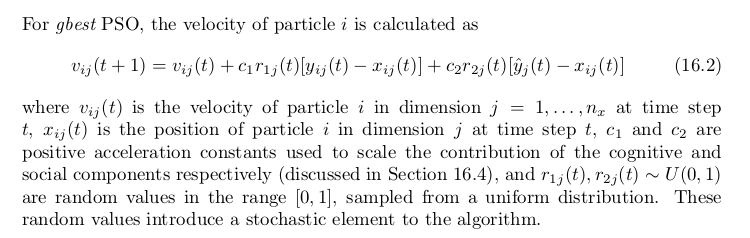
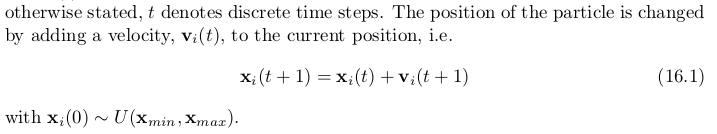
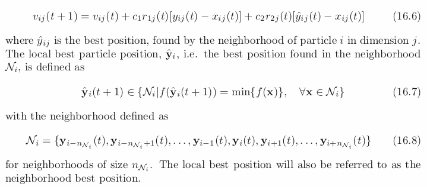

# PSO Algorithm
- A concept for the optimization of nonlinear functions using particle swarm methodology.
- Particle swarm optimization is based on artificial life (A-life) and to bird flocking, fish schooling, and swarming theory.  It is also related to evolutionary computation, and has ties to both genetic algorithms and evolutionary programming.
- The changes to a particle within the swarm are therefore influenced by the experience, or knowledge, of its neighbors. The search behavior of a particle is thus affected by that of other particles within the swarm (PSO is therefore a kind of symbiotic cooperative algorithm).

- *Particle behavior*: to emulate the success of neighboring individuals and their own successes. In simple terms, the particles are “flown” through a multidimensional search space, where the position of each particle is adjusted according to its own experience and that of its neighbors. The position of the particle is changed by adding a velocity to the current position

## Global Best PSO
- Velocity Updade

- Position Updade

- Pseudocode

# Local Best PSO
- Smaller neighborhoods are defined for each particle
- The social component reflects information exchanged within the neighborhood of the particle, reflecting local knowledge of the environment

- The velocity equation, the social contribution to particle velocity is proportional to the distance between a particle and the best position found by the neighborhood of particles.

- It is important to note that for the basic PSO, particles within a neighborhood have no relationship to each other. Selection of neighborhoods is done based on particle indices.

# References
- Particle Swarm Optimization. James Kennedy and Russell Eberhart. 1995
